# SHAREME - Share pics with other people

_SHAREME is a Single Page Application built with React that serves as a social network to exchange pictures with other people._

<br><br>
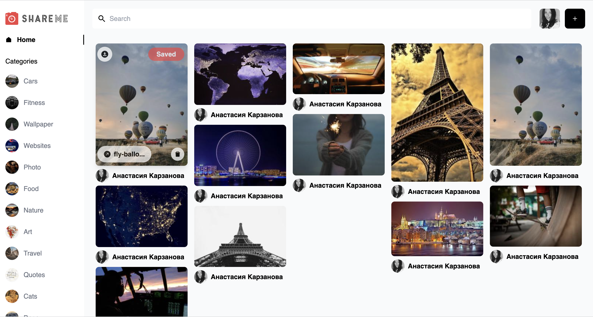
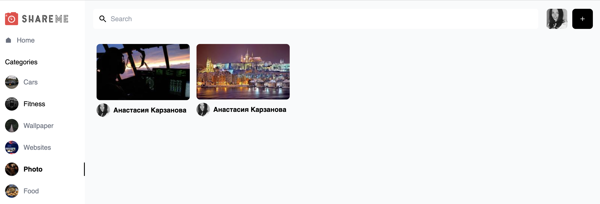
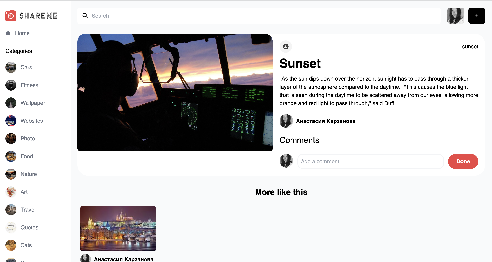
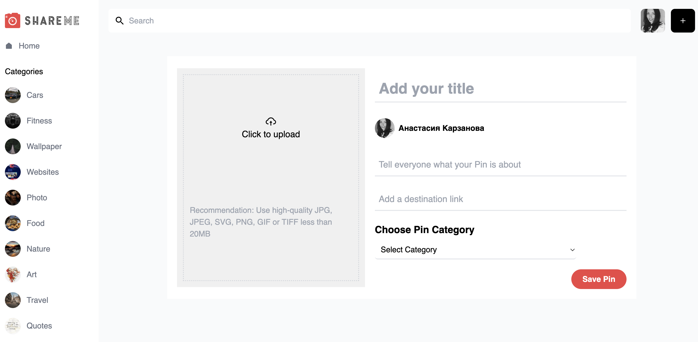
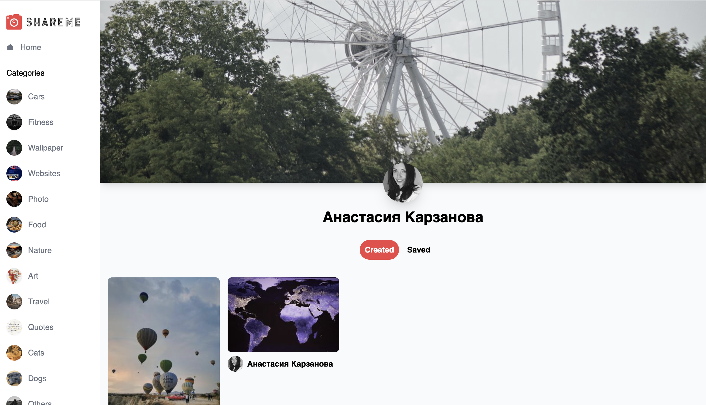
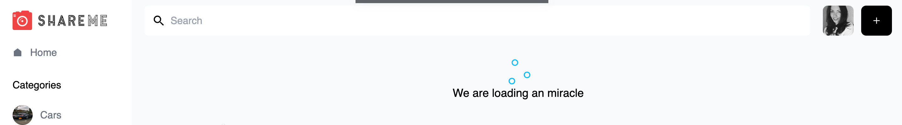
<br><br>

[Homepage] contains a collage of pins, list of categories, search bar and a button to add a new pin.

[PinsPage] collects all the pins of the category.

[PinDetailPage] shows all the information about the pin. Users can download the picture and add a comment. There is also more suggested pins of the same category at the bottom of the page - "More Like this".

[CreatePinPage] allows to upload a new pin with a picture, title, description, destination link and category.

[UserProfilePage] represents a user profile. Note that the background randomly changes its picture every time the page is reloaded, using external link.

## Adaptation

<br><br>
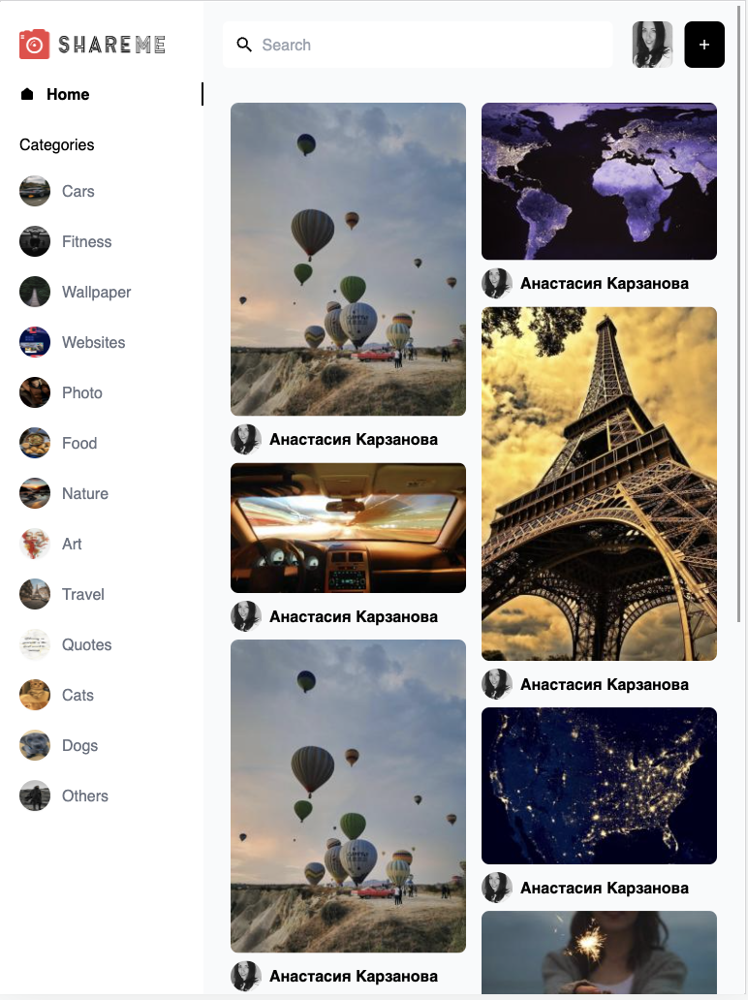
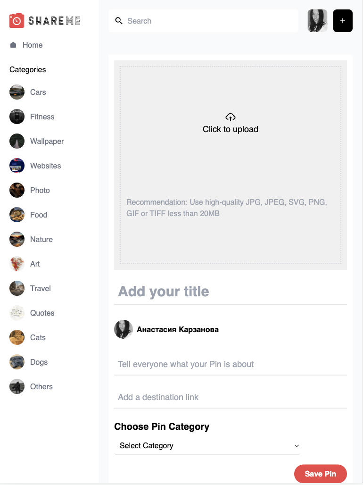
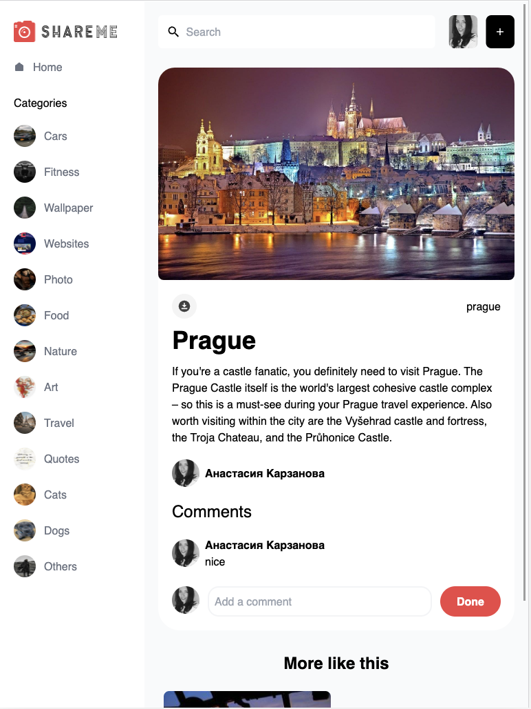
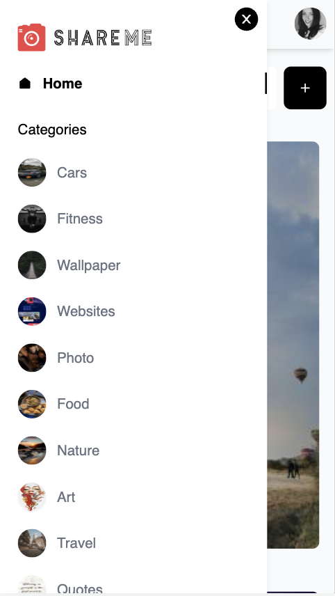
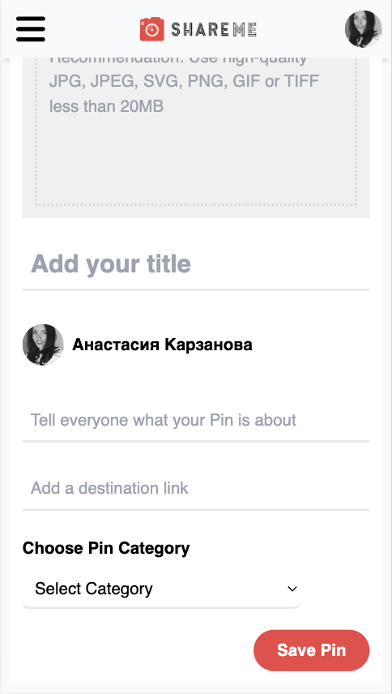

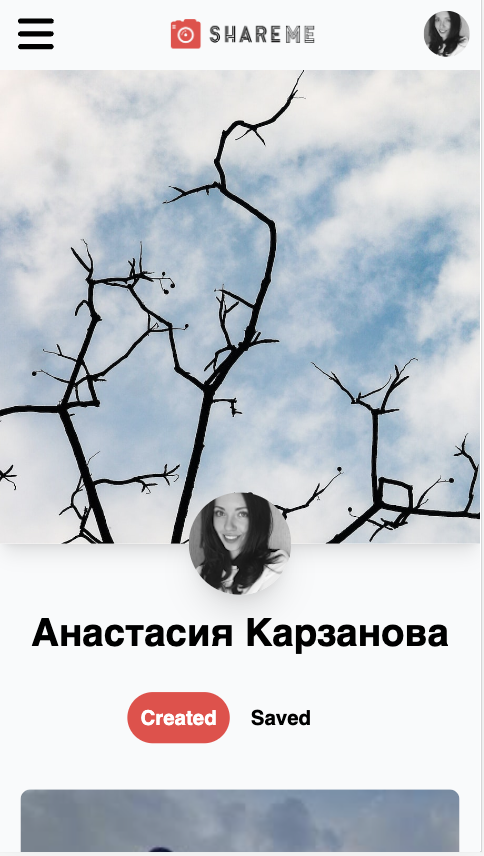
<br><br>

## Tech stack

&nbsp;&nbsp;&nbsp;&nbsp;&check;&nbsp;&nbsp; React<br>
&nbsp;&nbsp;&nbsp;&nbsp;&check;&nbsp;&nbsp; Functional Components<br>
&nbsp;&nbsp;&nbsp;&nbsp;&check;&nbsp;&nbsp; Hooks<br>
&nbsp;&nbsp;&nbsp;&nbsp;&check;&nbsp;&nbsp; Tailwind<br>
&nbsp;&nbsp;&nbsp;&nbsp;&check;&nbsp;&nbsp; Fetch API, Get and Post requests<br>
&nbsp;&nbsp;&nbsp;&nbsp;&check;&nbsp;&nbsp; React Router<br>
&nbsp;&nbsp;&nbsp;&nbsp;&check;&nbsp;&nbsp; Sanity<br>

## Installation

The following commands install and run the development version:

```bash
# Clone this repository
$ git clone https://github.com/nas-tay/ShareMe.git

# Go into the backend repository
$ cd backend

# Run Sanity Client
$ sanity manage
$ sanity start

# Go into the frontend repository
$ cd frontend

# Install dependencies
$ npm install

# Run the app
$ npm start
```

## Contributing

Contributions are always welcome! If you want to contribute:

```bash
# Clone repo and create a new branch:
$ git checkout -b name_for_new_branch

#  Make changes
#  Submit Pull Request with description of changes
```
